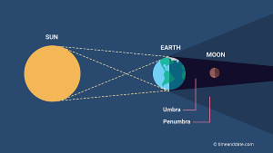
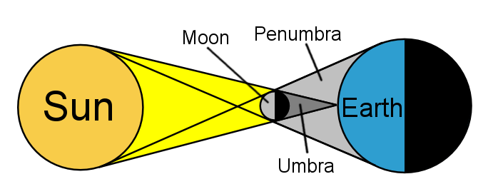

# Python Module for Ancient Indian Mathematics and Astronomy

- [X] 1. Aryabhata Cryptographic Calculator
    1. Calculate values from cryptographic words.
    1. Generate cryptographic words from numbers.
- [X] 2. Square Root When the Smaller Square Root is Known (Using Bodhaayana Approximation Method)
- [X] 3. Square Root (Bhaskara Method)
- [x] 4. Cube Root (Bhaskara Method)
- [x] 5. Solar Eclipse Calculator (Improved Siddhantic Procedure)
- [x] 6. Lunar Eclipse Calculator (Improved Siddhantic Procedure)
---

### Aryabhata Cryptographic Calculator

##### Shlok
```
वर्गात्राणि वर्गेऽवर्गेऽवर्गाताराणी का मौ यः ।
खद्विनवके स्वरा नव वर्गेऽवर्गे नवान्त्यवर्गे वा ॥
```

###### Table 1
Varg Consonants From `क्` to `म्` denote from `1` to `25`

|वर्ग:  | क | ख | ग | घ् | ङ् | च् | छ् | ज्  | झ् | ञ् | ट् | ठ् | ड् |
|-----|----|---|---|---|----|---|----|---|---|----|---|---|----|
|व्यञ्जन | 1 | 2 | 3 | 4 | 5   | 6 | 7 | 8 | 9 | 10 | 11 | 12 | 13 |
|     | ढ् | ण् | त् | थ् | द् | ध् | न् | प् | फ् | ब् | भ् | म् |
|     |14 |15  | 16| 17 | 18 | 19 | 20 | 21 | 22 |23 | 24 | 25 |

###### Table 2
Awarg consonants from `य्` to `ह्` denote from `3` to `10`

| अवर्गः | य् | र् | ल् | व् | श् | ष | स | ह |
|-----|----|---|---|---|----|---|----|---|
| व्यञ्जन | 3 | 4 | 5 | 6 | 7 | 8 | 9 | 10 |

###### Table 3
Vowels from `अ` to `औ` denote place-values from <code>10<sup>0</sup></code> to <code>10<sup>17</sup></code>

| स्वरः | अ | इ | उ | ऋ | लृ | ए | ऐ | ओ | औ |
|-----|----|---|---|---|----|---|----|---|---|
| वर्ग: | 10^0^ | 10^2^ | 10^4^ | 10^6^ | 10^8^ | 10^10^ | 10^12^ | 10^14^ | 10^16^ |
| अवर्गः | 10^1^ | 10^3^ | 10^5^ | 10^7^ | 10^9^ | 10^11^ | 10^13^ | 10^15^ | 10^17^ |
----

ढुविघ्व is the Aryabhatiya Alphabetical Numeral for the number of revolutions of Saturn in 43,20,000 years, and it is 1,46,564.
###### Explanation
ढुङ्विध्व = ( ढ उ ) + (ङ् इ) + (व् इ) + (घ् अ) + (व् अ) 
>= (14×10^4^ ) + (5×10^2^) + (6 ×10^3^) + (4 x 1 ) + (6 x 10 )
>=1,46,564.

---
#### Decode
##### Code
```python
from AncIndMatAst import AC
word="जषबिखुछृ"
value=AC.decode(word)
print(f"Value of {word} = {value}")
```
##### Output
```
Value of जषबिखुछृ = 7022388
```
#### Encode
##### Code
```python
from AncIndMatAst import AC
data=AC.encode(364224)
print(data.get("sabd"))
print(data.get("length"))
print(data.get("allSabd"))
```
##### Output
```
भखिरिचुयु
120
['भखिरिचुयु', 'भखिरियुचु', 'भखिचुरियु', 'भखिचुयुरि', 'भखियुरिचु', 'भखियुचुरि', 'भरिखिचुयु', 'भरिखियुचु', 'भरिचुखियु', 'भरिचुयुखि', 'भरियुखिचु', 'भरियुचुखि', 'भचुखिरियु', 'भचुखियुरि', 'भचुरिखियु', 'भचुरियुखि', 'भचुयुखिरि', 'भचुयुरिखि', 'भयुखिरिचु', 'भयुखिचुरि', 'भयुरिखिचु', 'भयुरिचुखि', 'भयुचुखिरि', 'भयुचुरिखि', 'खिभरिचुयु', 'खिभरियुचु', 'खिभचुरियु', 'खिभचुयुरि', 'खिभयुरिचु', 'खिभयुचुरि', 'खिरिभचुयु', 'खिरिभयुचु', 'खिरिचुभयु', 'खिरिचुयुभ', 'खिरियुभचु', 'खिरियुचुभ', 'खिचुभरियु', 'खिचुभयुरि', 'खिचुरिभयु', 'खिचुरियुभ', 'खिचुयुभरि', 'खिचुयुरिभ', 'खियुभरिचु', 'खियुभचुरि', 'खियुरिभचु', 'खियुरिचुभ', 'खियुचुभरि', 'खियुचुरिभ', 'रिभखिचुयु', 'रिभखियुचु', 'रिभचुखियु', 'रिभचुयुखि', 'रिभयुखिचु', 'रिभयुचुखि', 'रिखिभचुयु', 'रिखिभयुचु', 'रिखिचुभयु', 'रिखिचुयुभ', 'रिखियुभचु', 'रिखियुचुभ', 'रिचुभखियु', 'रिचुभयुखि', 'रिचुखिभयु', 'रिचुखियुभ', 'रिचुयुभखि', 'रिचुयुखिभ', 'रियुभखिचु', 'रियुभचुखि', 'रियुखिभचु', 'रियुखिचुभ', 'रियुचुभखि', 'रियुचुखिभ', 'चुभखिरियु', 'चुभखियुरि', 'चुभरिखियु', 'चुभरियुखि', 'चुभयुखिरि', 'चुभयुरिखि', 'चुखिभरियु', 'चुखिभयुरि', 'चुखिरिभयु', 'चुखिरियुभ', 'चुखियुभरि', 'चुखियुरिभ', 'चुरिभखियु', 'चुरिभयुखि', 'चुरिखिभयु', 'चुरिखियुभ', 'चुरियुभखि', 'चुरियुखिभ', 'चुयुभखिरि', 'चुयुभरिखि', 'चुयुखिभरि', 'चुयुखिरिभ', 'चुयुरिभखि', 'चुयुरिखिभ', 'युभखिरिचु', 'युभखिचुरि', 'युभरिखिचु', 'युभरिचुखि', 'युभचुखिरि', 'युभचुरिखि', 'युखिभरिचु', 'युखिभचुरि', 'युखिरिभचु', 'युखिरिचुभ', 'युखिचुभरि', 'युखिचुरिभ', 'युरिभखिचु', 'युरिभचुखि', 'युरिखिभचु', 'युरिखिचुभ', 'युरिचुभखि', 'युरिचुखिभ', 'युचुभखिरि', 'युचुभरिखि', 'युचुखिभरि', 'युचुखिरिभ', 'युचुरिभखि', 'युचुरिखिभ']
Value of जषबिखुछृ = 7022388
```
---
### Bodhaayana Square Root (Approximation Method)

##### Shlok
```
प्रमाणं तृत्तीयेन वर्धयेत् तच्च चतुर्थेनात्म चतुस्त्रिम्शोनेन सविशेष:
```
##### Explanation
The measure is to be increased by its third and this (third) again by its own fourth less the thirty fourth part (of that fourth); this is (the value of) the diagonal of a square (whole side is the measure).

##### Code
```python
from AncIndMatAst import BA
num=200
sq=BA.squareRoot(num)
print("Square Root By Bodhaayana Approximation Method = ",sq)
```
##### Output
```
Square Root By Bodhaayana Approximation Method =  14.1421356237469
```
---
### Roots (Bhaskara Method)

### Square Root
###### Shlok
```
Tyaktvaamtyaat Vishamaat kritim
    Dvigunayenmulam same taddhrite 
Tyaktvaa labdhakritim tadaadya vishamaat 
    Labdham dvinighnam nyaset

Panktyaam panktihrite samenyavishamaat 
    Tyaktvaptavargam phalam 
Panktyaam taddvigumam nyasediti muhuh 
    Pankterdalam syaatpadam
```
###### Explanation
1. Start observing the given number from RHS
2. Put dots on the digits appearing at all the odd places (that is, 1, 3, 5, 7 etc. places) starting from RHS
3. Start processing the given number from LHS. 
4. Remember that the terms of (a+b)=a²+2ab+b² formula will be used to find the square root 
5. Select the leftmost set of digits having the dot and call it X1.
6. Identify a value of a (where a=1,2,3,4,5,6,7,8,9) which is the biggest value that can be subtracted from XI.
7. Keep the corresponding value of 'a' in the result location.
8. Subtract that a from XI and call the resultant value X2.
9. Append the next digit of the given number to X2 for continuing the processing. Call it as X3. 
10. Divide X3 by 2*a. Identify the quotient as 'b' (Maximum value of b can be 9).
11. Subtract 2*a*b from X3 and call the resultant value X4
12. Append the next digit of the given number to X4 for continuing the processing. Call
it as X5. 
13. Subtract b³ from X5 and call the resultant value X6,
14. If any of the above two subtractions give negative value, reduce the value of bby one and revert back to step 11.
15. Concatenate the values of 'a' and 'b'. Call it as 'ab'. 
16. This value is the square root of the group of digits processed so far.
17. If some more digits are still pending for processing in the given number, take the present value of ab as new 'a'. Take the value of X6 as X2. Repeat the process from step 9.

##### Code
```python
from AncIndMatAst import BM
num=144
sq=BM.squareRoot(num)
print("Square Root By Bhaskara Method = ",sq)
```
##### Output
```
Square Root By Bhaskara Method =  12
```
---
### Cube Root
###### Shlok
```
Adyam ghanasthanamathaaghane dve 
    Punastathantyaat ghanto visodhya
Ghanam prithakstham padamasya krityan
    Trighnyaa tadaadyam vibhajet phalam tu

Panktyaam nyaset tatkritimantyanighneem
    Trighneem tyajet tatprathamaat phalasya
Ghanam tadaadyaat ghanamulamevam
Panktirbhavedevamatah punasca
```
---
###### Explanation
1. Start observing the given number from RHS
2. Put dots on the digits appearing at 1st , 4th , 7th , 9th etc. places starting from RHS
3. Start processing the given number from LHS
4. Remember that the terms of (a + b)3 = a ^ 3 + 3a ^ 2 * b + 3a * b ^ 2 + b3 formula will be used to find the cube root
5. Select the leftmost set of digits having the dot and call it XI.
6. Identify a value of a ^ 3 where a (1,2,3,4,5,6,7,8,9) which is the biggest value that can be subtracted from XI.
7. keep the corresponding value of 'a' in the result location. 8. Subtract that a ^ 2 from X1 and call the resultant value X2.
9. Append the next digit of the given number to X2 for continuing the processing. Call it as X3.
10. Divide X3 by 3^ * a ^ 2 Identify the quotient as "b.(Maximum value of b can be 9).
11. Subtract 3 *a^ 2* b from X3 and call the resultant value X4
12. Append the next digit of the given number to X4 for continuing the processing. Call it as XS.
13. Subtract 3 a b from X5 and call the resultant value X6.
14. Append the next digit of the given number to X6 for continuing the processing. Call it
as X7.
15. Subtract b' from X7 and call the resultant value X8.
16. If any of the above three subtractions give negative value, reduce the value of b by one and revert back to step 11.
17. Concatenate the values of "a" and "b". Call it as 'ab'.
18. This value will be the cube root of the group of digits processed so far.
19. If some more digits are still pending for processing in the given number, take the present value of ab as new 'a' Take the value of X8 as X2. Repeat the process from step 9

###### Illustration
```
To Find the cube root of 9261:
1. Start observing the given number from RHS
2. Put dots on the digits appearing at 1st and 4th places starting from RHS, viz., or 1 and 9.
3. Start processing the given number from LHS
4. Remember that the terms of (a + b)^3 = a ^ 3 + 3a ^ 2 * b + 3a * b ^ 2 + b ^ 1 formula will be used in find the cube root
5. Select the leftmost set of digits having the dot and call it XI.
6. X1=9
7. Identity a value of a ^ 3 * (- 8) which is the biggest value that can be subtracted from XI.
8. keep the corresponding value of ^ * a' (=2) in the result location.
9 Subtract that a from X1 and call the resultant value X2.
10. X2 = 9 - 8 = 1
11. Append the next digit of the given number to X2 for continuing the processing Call it as X3.
12. X3 = 12
13. Divide X3 by 3*a ^ 2 (=12)
14. Identify the quotient as "b".
15. b=1
16. Subtract 3 ab from X3 and call the resultant value X4
17. X4 = 12 - 12 = 0
18. Append the next digit of the given number to X4 for continuing the processing Cal it as X5.
19. X5 = 06
20. Subtract 3^ * a^ * b ^ 2 from X5 and call the resultant value X6.
21. X6=06-6-0
22. Append the next digit of the given minber to X6 for continuing the processing. Call it us XT.
23. X7=01
24. Subtract b' from X7 and call the resultant value X8
25. X8=01-1-0
26. Concatenate the values of 'a' and 'b. Call it as ab 27, ab21
28. This value 21 is the cube root of the given number 9261
Result = 21
```

##### Code
```python
from AncIndMatAst import BM
num=175616
sq=BM.cubeRoot(num)
print("Cube Root By Bhaskara Method = ",sq)
```
##### Output
```
Cube Root By Bhaskara Method =  56
```

---
### Siddhantic Procedure for Lunar and Solar Eclipse

#### Lunar Eclipse

###### Code
```python
from AncIndMatAst import Eclipse
date = (2006, 10, 7)
time = (24,12,0)
trueMoon=(321,3,27)
trueRahu=(331,21,11)
Eclipse.LunarEclipse(date,time,trueMoon,trueRahu)
```
###### Output
```
Lunar Eclipse Detail of 07 October 2006
Eclipse Type :  Partial
Magnitude of Eclipse :  0.18
Timings of Eclipse :
Beginnig of Eclipse :  23h 35m 23s
Middle of Eclipse :  24h 21m 24s
End of Eclipse :  25h 7m 25s
```

#### Solar Eclipse

###### Code
```python
from AncIndMatAst import Eclipse
date = (2008, 8, 1)
iONMoon=(15,42,0)
trueMoon=(105,33,0)
trueRahu=(294,37,26)
Eclipse.SolarEclipse(date,iONMoon,trueMoon,trueRahu)
```
###### Output
```
Solar Eclipse Detail of 01 August 2008
Eclipse Type :  Total
Magnitude of Eclipse :  1.34
Timings of Solar Eclipse :
Beginnig of Eclipse :  13h 31m 13s
Beginnig of Totality :  14h 45m 14s
Middle of Eclipse :  15h 50m 15s
End of Totality :  16h 55m 16s
End of Eclipse :  18h 8m 18s
```